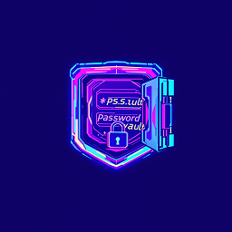

# Passwault - Modern Password Manager

<div align="center">
  
  <br>
  <p>
    <strong>A secure, modern, and user-friendly password manager built with Electron and React</strong>
  </p>
</div>

## 🌟 Features

- 🔐 **Secure Password Generation**
  - Customizable password length
  - Include numbers, symbols, and uppercase letters
  - One-click copy to clipboard

- 🎨 **Modern User Interface**
  - Clean and intuitive design
  - Dark/Light mode support
  - Smooth animations and transitions
  - Responsive layout

- 📝 **Password Management**
  - Save passwords with associated websites/apps
  - Search functionality for quick access
  - Show/Hide password toggle
  - Easy deletion of stored passwords

- 🔒 **Security**
  - Local database storage using SQLite
  - No cloud storage, keeping your data private
  - Secure user authentication

## 🚀 Getting Started

### Prerequisites

- Node.js (v14 or higher)
- npm or yarn

### Installation

1. Clone the repository:
```bash
git clone https://github.com/enverkaradede/passwault.git
cd passwault
```

2. Install dependencies:
```bash
npm install
# or
yarn install
```

3. Start the application:
```bash
npm start
# or
yarn start
```

### Building for Production

To create a production build:
```bash
npm run package
# or
yarn package
```

## 🛠️ Built With

- [Electron](https://www.electronjs.org/) - Cross-platform desktop framework
- [React](https://reactjs.org/) - UI library
- [TypeScript](https://www.typescriptlang.org/) - Programming language
- [Tailwind CSS](https://tailwindcss.com/) - CSS framework
- [better-sqlite3](https://github.com/JoshuaWise/better-sqlite3) - SQLite database

## 📖 Usage

1. **Login**: Use your credentials to access the application
2. **Generate Password**: 
   - Adjust password length using the slider
   - Toggle options for numbers, symbols, and uppercase letters
   - Click "Generate Password" to create a new password

3. **Save Password**:
   - Enter the website/app name and username
   - Generate or input a password
   - Click "Save Password" to store

4. **Manage Passwords**:
   - View all saved passwords
   - Use the search bar to find specific entries
   - Copy passwords to clipboard
   - Show/hide password content
   - Delete unwanted entries

5. **Theme Toggle**:
   - Switch between light and dark modes using the theme toggle button

## 🔐 Security

- Passwords are stored locally in a SQLite database
- No data is sent to external servers
- Authentication required for access
- Session management for security

## 🤝 Contributing

Contributions are welcome! Please feel free to submit a Pull Request. For major changes, please open an issue first to discuss what you would like to change.

1. Fork the Project
2. Create your Feature Branch (`git checkout -b feature/AmazingFeature`)
3. Commit your Changes (`git commit -m 'Add some AmazingFeature'`)
4. Push to the Branch (`git push origin feature/AmazingFeature`)
5. Open a Pull Request

## 📝 License

This project is licensed under the MIT License - see the [LICENSE](LICENSE) file for details.

## 🙏 Acknowledgments

- [electron-react-boilerplate](https://github.com/electron-react-boilerplate/electron-react-boilerplate)
- [React Icons](https://react-icons.github.io/react-icons/)
- All contributors and supporters

## 📧 Contact

Your Name - [@enverkaradede](https://instagram.com/enverkaradede)

Project Link: [https://github.com/enverkaradede/passwault](https://github.com/enverkaradede/passwault)

---

<div align="center">
  Made with ❤️ by <a href="https://github.com/enverkaradede">Enver Karadede</a>
</div>